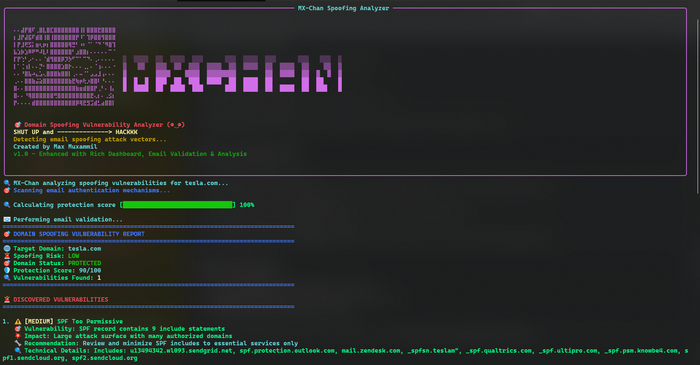

# 🎯MX-Chan - [Spoofable Domain Vulnerability Scanner]

```
⠄⠄⣼⡟⣿⠏⢀⣿⣇⣿⣏⣿⣿⣿⣿⣿⣿⣿⢸⡇⣿⣿⣿⣟⣿⣿⣿⣿                                                              
⡆⣸⡟⣼⣯⠏⣾⣿⢸⣿⢸⣿⣿⣿⣿⣿⣿⡟⠸⠁⢹⡿⣿⣿⢻⣿⣿⣿                                                              
⡇⡟⣸⢟⣫⡅⣶⢆⡶⡆⣿⣿⣿⣿⣿⢿⣛⠃⠰⠆⠈⠁⠈⠙⠈⠻⣿⢹                                                              
⣧⣱⡷⣱⠿⠟⠛⠼⣇⠇⣿⣿⣿⣿⣿⣿⠃⣰⣿⣿⡆⠄⠄⠄⠄⠄⠉⠈                                                              
⡏⡟⢑⠃⡠⠂⠄⠄⠈⣾⢻⣿⣿⡿⡹⡳⠋⠉⠁⠉⠙⠄⢀⠄⠄⠄⠄⠄  ░  ░░░░  ░░  ░░░░  ░░░      ░░░  ░░░░  ░░░      ░░░   ░░░  ░
⡇⠁⢈⢰⡇⠄⠄⡙⠂⣿⣿⣿⣿⣱⣿⡗⠄⠄⠄⢀⡀⠄⠈⢰⠄⠄⠄⠐  ▒   ▒▒   ▒▒▒  ▒▒  ▒▒▒  ▒▒▒▒  ▒▒  ▒▒▒▒  ▒▒  ▒▒▒▒  ▒▒    ▒▒  ▒
⠄⠄⠘⣿⣧⠴⣄⣡⢄⣿⣿⣿⣷⣿⣿⡇⢀⠄⠤⠈⠁⣠⣠⣸⢠⠄⠄⠄  ▓        ▓▓▓▓    ▓▓▓▓  ▓▓▓▓▓▓▓▓        ▓▓  ▓▓▓▓  ▓▓  ▓  ▓  ▓
⢀⠄⠄⣿⣿⣷⣬⣵⣿⣿⣿⣿⣿⣿⣿⣷⣟⢷⡶⢗⡰⣿⣿⠇⠘⠄⠄⠄  █  █  █  ███  ██  ███  ████  ██  ████  ██        ██  ██    █
⣿⠄⠄⣿⣿⣿⣿⣿⣿⣿⣿⣿⣿⣿⣿⣿⣿⣷⣶⣾⣿⣿⡟⢀⠃⠄⢸⡄  █  ████  ██  ████  ███      ███  ████  ██  ████  ██  ███   █
⣿⠄⠄⠘⢿⣿⣿⣿⣿⣿⣿⢛⣿⣿⣿⣿⣿⣿⣿⣿⣿⣟⢄⡆⠄⢀⣪⡆                           
⡟⠄⠄⠄⠄⣾⣿⣿⣿⣿⣿⣿⣿⣿⣿⣿⣿⡿⢿⣟⣻⣩⣾⣃⣴⣿⣿⡇                           

   🎯 Domain Spoofing Vulnerability Analyzer (◕‿◕)
   SHUT UP and --------------> HACKKK
   Detecting email spoofing attack vectors...
   Created by Max Muxammil
   v1.0 - Enhanced with Rich Dashboard, Email Validation & Analysis
```

**Domain Spoofing Vulnerability Analyzer (Python Edition)**

A specialized defensive security tool for detecting email spoofing vulnerabilities by analyzing SPF, DMARC, and DKIM configurations to determine domain spoofing risk. Now with enhanced Rich terminal UI and comprehensive email validation capabilities.

## 🌟 Features

### 🎨 Enhanced Terminal UI
- **Rich Dashboard**: Beautiful bordered panels with color-coded output
- **Custom Progress Bars**: Real-time animated progress tracking
- **Professional Banner**: ASCII art with Rich formatting
- **Color-Coded Results**: Green (secure), Red (vulnerable), Yellow (warning)

### 🔍 Comprehensive DNS Analysis
- **SPF Record Analysis**: Detects missing, weak, or dangerous policies
- **DMARC Policy Evaluation**: Checks enforcement levels and subdomain policies  
- **DKIM Signature Validation**: Scans multiple selectors and key strengths
- **MX Record Assessment**: Identifies routing and wildcard vulnerabilities

### 📧 Advanced Email Validation
- **Format Validation**: Regex-based email syntax checking
- **Domain Matching**: Verifies email domain against target domain
- **SMTP Connectivity**: Tests mail server reachability on port 25
- **Real-time Verification**: Attempts email existence validation
- **Detailed Reporting**: Comprehensive validation results with status indicators

### 📊 Risk Assessment & Scoring
- **Protection Score**: 0-100 scoring system based on vulnerabilities
- **Risk Levels**: CRITICAL, HIGH, MEDIUM, LOW, VERY_LOW classifications
- **Spoofability Assessment**: Determines if domain can be spoofed
- **Actionable Recommendations**: Specific remediation guidance

## 🛡️ Security Analysis Coverage

### SPF (Sender Policy Framework)
- ❌ **Missing SPF Records** (CRITICAL)
- 🚨 **Dangerous Policies** (`+all` allows any sender)
- ⚠️ **Weak Policies** (`~all` soft fail, `?all` neutral)
- 📝 **Incomplete Records** (missing `all` mechanism)
- 🔍 **Overly Permissive** (too many includes)

### DMARC (Domain-based Message Authentication)
- ❌ **Missing DMARC Policy** (CRITICAL)
- 📊 **Policy Strength** (`none`, `quarantine`, `reject`)
- 🌐 **Subdomain Weaknesses** (weaker subdomain policies)
- 📈 **Partial Enforcement** (percentage < 100%)

### DKIM (DomainKeys Identified Mail)
- ❌ **Missing DKIM** (HIGH risk)
- 🔐 **Weak Cryptographic Keys** (< 2048 bits)
- 🔍 **Common Selectors** (default, selector1, selector2, google, k1, s1, s2)

### Additional Security Vectors
- 📬 **MX Record Analysis** (missing or wildcard MX)
- 🌐 **Mail Routing** (potential manipulation vectors)
- 🔗 **DNS Configuration** (resolution and timeout handling)

## 🚀 Installation

### Prerequisites
- Python 3.7+
- DNS resolution capability
- Internet connection for DNS queries

### Install Dependencies
```bash
# Install required packages
pip3 install -r requirements.txt

# Or install manually
pip3 install dnspython requests rich
```

### Download and Setup
```bash
# Clone or download the script
wget https://raw.githubusercontent.com/maxmuxammil/mx-chan/main/mxchan.py
chmod +x mxchan.py
```

## 📖 Usage

### Basic Domain Analysis
```bash
python3 mxchan.py example.com
```

### Email Validation
```bash
# Validate email address
python3 mxchan.py example.com --email admin@example.com
python3 mxchan.py example.com -e user@gmail.com
```

### Debug Mode
```bash
# Enable debug output for troubleshooting
python3 mxchan.py --debug gmail.com
python3 mxchan.py -d example.com --email user@example.com
```

### Command Reference
```bash
python3 mxchan.py --help                    # Show help with Rich banner
python3 mxchan.py [OPTIONS] DOMAIN          # Full syntax
```

### Available Options
- `-e, --email EMAIL`: Email address to validate (optional)
- `-d, --debug`: Enable debug output for DNS queries
- `-h, --help`: Show help message with Rich banner

## 📊 Sample Output

### Domain Analysis Report
```
╭───────────────────────── MX-Chan Spoofing Analyzer ──────────────────────────╮
│       🎯 Domain Spoofing Vulnerability Analyzer (◕‿◕)                        │
│       SHUT UP and --------------> HACKKK                                     │
╰──────────────────────────────────────────────────────────────────────────────╯

🔍 Analyzing SPF records    [██████░░░░░░░░░░░░░░░░░░░░░░░░] 20%
🔍 Analyzing DMARC records  [████████████░░░░░░░░░░░░░░░░░░] 40%
🔍 Analyzing DKIM records   [██████████████████░░░░░░░░░░░░] 60%
🔍 Checking additional vectors [████████████████████████░░░░░░] 80%
🔍 Calculating protection score [██████████████████████████████] 100%

================================================================================
🎯 DOMAIN SPOOFING VULNERABILITY REPORT
================================================================================
🌐 Target Domain: example.com
🚨 Spoofing Risk: HIGH
🎯 Domain Status: SPOOFABLE
🛡️ Protection Score: 45/100
🔍 Vulnerabilities Found: 3

🚨 DISCOVERED VULNERABILITIES
================================================================================

1. 🚨 [CRITICAL] SPF Missing
   🎯 Vulnerability: No SPF record found
   💥 Impact: Domain can be easily spoofed from any IP address
   🔧 Recommendation: Implement SPF record immediately with '-all' mechanism
   🔍 Technical Details: Missing SPF allows unlimited spoofing potential

2. 🚨 [CRITICAL] DMARC Missing
   🎯 Vulnerability: No DMARC record found
   💥 Impact: No policy enforcement against domain spoofing
   🔧 Recommendation: Implement DMARC policy starting with p=none, then escalate to p=reject
   🔍 Technical Details: Missing DMARC allows spoofing with no reporting
```

### Email Validation Results
```
📧 EMAIL VALIDATION REPORT
================================================================================
📧 Email Address: admin@example.com
📝 Format: ✅ VALID
🌐 Domain Match: ✅ MATCHES
📬 SMTP Server: ❌ UNREACHABLE
🔍 Email Exists: ❓ UNKNOWN

📋 VALIDATION DETAILS
------------------------------------------------------------
   • Format: Valid format
   • Domain_Match: Email domain matches target domain
   • Smtp: No SMTP servers reachable on port 25
   • Existence: Could not determine primary MX server
```

## 📊 Risk Assessment System

### Risk Levels
| Level | Icon | Score Impact | Description | Action Required |
|-------|------|--------------|-------------|-----------------|
| **CRITICAL** | 🚨 | -30 points | Immediate security risk | Fix immediately |
| **HIGH** | 🔶 | -20 points | Significant vulnerability | Address promptly |
| **MEDIUM** | ⚠️ | -10 points | Moderate security concern | Plan remediation |
| **LOW** | ✅ | -5 points | Minor configuration issue | Monitor and improve |

### Scoring Algorithm
- **Base Score**: 100/100 (perfect protection)
- **Vulnerability Deductions**: Based on severity levels above
- **Final Score**: Maximum of 0 (completely vulnerable)

### Risk Determination Logic
- **CRITICAL**: Any critical vulnerabilities present
- **HIGH**: 2+ high-risk vulnerabilities  
- **MEDIUM**: 1 high-risk OR 3+ medium-risk vulnerabilities
- **LOW**: 1+ medium-risk vulnerabilities
- **VERY LOW**: No significant vulnerabilities detected

## 🛠️ Remediation Guide

### Implement SPF Record
```dns
; Basic SPF record (blocks all unauthorized senders)
example.com. IN TXT "v=spf1 -all"

; SPF with Google Workspace
example.com. IN TXT "v=spf1 include:_spf.google.com -all"

; SPF with multiple providers
example.com. IN TXT "v=spf1 include:_spf.google.com include:spf.protection.outlook.com -all"
```

### Implement DMARC Policy
```dns
; Start with monitoring (p=none)
_dmarc.example.com. IN TXT "v=DMARC1; p=none; rua=mailto:dmarc@example.com; ruf=mailto:dmarc@example.com"

; Progress to quarantine suspicious emails
_dmarc.example.com. IN TXT "v=DMARC1; p=quarantine; rua=mailto:dmarc@example.com"

; Full protection (reject unauthorized emails)
_dmarc.example.com. IN TXT "v=DMARC1; p=reject; sp=reject; adkim=s; aspf=s; rua=mailto:dmarc@example.com"
```

### Enable DKIM Signing
1. **Generate DKIM Keys**: Use 2048-bit RSA or stronger
2. **Configure Email Provider**: Enable DKIM in your email service
3. **Publish Public Key**: Add DKIM record to DNS
```dns
selector1._domainkey.example.com. IN TXT "v=DKIM1; k=rsa; p=MIGfMA0GCSqGSIb3DQEBAQUAA4GNADCBiQKBgQC..."
```

## 🔍 Technical Implementation

### DNS Resolution
- **Primary Resolvers**: 8.8.8.8, 1.1.1.1, 1.0.0.1
- **Timeout Settings**: 3 seconds per query, 10 seconds total lifetime
- **Error Handling**: Graceful fallback for NXDOMAIN and NoAnswer

### Email Validation Process
1. **Format Validation**: RFC-compliant regex checking
2. **Domain Extraction**: Parse and validate domain portion
3. **MX Record Lookup**: Find mail exchange servers
4. **SMTP Testing**: Direct connection attempts on port 25
5. **Response Analysis**: Interpret connection results

### Progress Tracking
- **Custom Progress Bars**: Terminal-safe animated indicators
- **Real-time Updates**: Live progress display during analysis
- **Phase Indicators**: Clear status for each analysis step

### Rich UI Components
- **Bordered Panels**: Professional presentation with Rich library
- **Color Coding**: Consistent color scheme throughout interface
- **Text Formatting**: Bold, italic, and colored text elements
- **Alignment**: Centered and left-aligned content as appropriate

## 🚨 Disclaimer

This tool is designed for **defensive security purposes only**. It should be used to:
- ✅ Assess your own domains and email infrastructure  
- ✅ Conduct authorized security assessments with proper permissions
- ✅ Improve email authentication configurations and policies
- ✅ Educate teams about email spoofing vulnerabilities

**⚠️ Do not use this tool for malicious purposes or against domains you don't own or have explicit permission to test.**

## 🔧 Dependencies

- **dnspython** (>=2.0.0): DNS resolution and record parsing
- **requests** (>=2.25.0): HTTP requests for additional lookups
- **rich** (>=10.0.0): Enhanced terminal UI and formatting

## 📄 License

This project is licensed under the MIT License - see the LICENSE file for details.

## 🙏 Acknowledgments

- Built for defensive security and domain protection awareness
- Inspired by the need for better email authentication visibility
- Thanks to the DNS and email security community for standards development
- Rich library for beautiful terminal interfaces

## 🔗 Resources

### Email Authentication Standards
- [RFC 7208 - SPF](https://tools.ietf.org/html/rfc7208)
- [RFC 7489 - DMARC](https://tools.ietf.org/html/rfc7489) 
- [RFC 6376 - DKIM](https://tools.ietf.org/html/rfc6376)

### Security References
- [OWASP Email Security](https://owasp.org/www-project-cheat-sheets/cheatsheets/Email_Security_Cheat_Sheet.html)
- [M3AAWG Email Authentication](https://www.m3aawg.org/email-authentication)

##Screenshot



---

**✨ Stay secure and keep those spoofing attacks away! (◕‿◕)**
**🛡️ Remember: Strong email authentication prevents domain spoofing!**